# Period Runtime Architecture

Этот файл описывает именно period-подсистему: как период поднимается из bootstrap, как живёт локально, как пересчитывается и как уходит в checkpoint.

## Ключевая идея

Периодный слой устроен как state-driven контур вокруг `PeriodRuntimeState`.

- `PeriodGameplayService` владеет текущим состоянием периода.
- `PeriodRuntimeFactory` строит или восстанавливает runtime периода.
- `PeriodCalculationEngine` пересчитывает деньги, активы, остаток и УЖЭ.
- `PeriodCheckpointBuilder` превращает runtime периода в payload для backend.
- UI не содержит расчётов и не владеет состоянием: он только рендерит `PeriodRuntimeState` и отправляет команды в сервис.

## Диаграмма классов

```mermaid
classDiagram
direction LR

class GameplayState {
  +Enter()
  +Exit()
}

class IPeriodGameplayService {
  <<interface>>
  +Current : PeriodRuntimeState
  +Changed
  +ActivateCurrentPeriod()
  +SetExpenseAmount(expenseId, rawAmount)
  +CycleExpenseSource(expenseId)
  +OpenAssetDialog(assetId, kind)
  +CycleAssetDialogSource()
  +SubmitAssetDialog(rawAmount)
  +CloseAssetDialog()
  +SubmitPeriod()
  +ClearRuntime()
}

class PeriodGameplayService {
  -_sessionCoordinator : ISessionCoordinator
  -_persistenceService : ISessionPersistenceService
  -_runtimeFactory : IPeriodRuntimeFactory
  -_calculationEngine : IPeriodCalculationEngine
  -_checkpointBuilder : IPeriodCheckpointBuilder
  -_checkpointSender : ICheckpointSender
  -_popupNavigation : IPopupNavigationService
  -_current : PeriodRuntimeState
  +Current : PeriodRuntimeState
  +Changed
}

class IPeriodRuntimeFactory {
  <<interface>>
  +TryCreateNew(clientRuntime, runtimeState, error)
  +TryRestore(clientRuntime, snapshot, runtimeState, error)
}

class PeriodRuntimeFactory {
  -_calculationEngine : IPeriodCalculationEngine
  -_serializer : IJsonSerializer
  -_logger : IAppLogger
}

class IPeriodCalculationEngine {
  <<interface>>
  +Recalculate(definition, expenses, assetOperations) PeriodCalculationSummary
}

class PeriodCalculationEngine {
  +Recalculate(definition, expenses, assetOperations) PeriodCalculationSummary
}

class IPeriodCheckpointBuilder {
  <<interface>>
  +TryBuild(runtimeState, request, error)
}

class PeriodCheckpointBuilder {
  -_serializer : IJsonSerializer
  +TryBuild(runtimeState, request, error)
}

class ISessionCoordinator {
  <<interface>>
  +CurrentRuntime : ClientRuntimeState
  +RuntimeChanged
}

class ISessionPersistenceService {
  <<interface>>
  +SavePeriodSnapshot(...)
  +TryLoadPeriodSnapshot(snapshot)
  +ClearPeriodSnapshot()
}

class ICheckpointSender {
  <<interface>>
  +Send(runId, token, request, callback)
}

class GameplayPlaceholderScreenController {
  -_view : GameplayPlaceholderScreenView
  +Open()
  +Dispose()
}

class GameplayPlaceholderScreenView {
  +Render(runtimeState, ...)
}

class AssetOperationPopup {
  +OnInitialize()
  +Close()
}

class PeriodRuntimeState {
  +RunId
  +PeriodNumber
  +FlowState
  +Definition : PeriodRuntimeDefinition
  +Expenses : PeriodExpenseState[]
  +AssetOperations : PeriodAssetOperationEntry[]
  +Summary : PeriodCalculationSummary
  +AssetDialog : AssetOperationDialogState
  +IsCheckpointSubmitted
  +StatusMessage
  +LastError
  +HasPendingLocalChanges
}

class PeriodRuntimeDefinition {
  +Meta : PeriodMeta
  +InfoBlockValues : PeriodInfoBlockValue[]
  +ExpenseDefinitions : PeriodExpenseDefinition[]
  +AssetDefinitions : PeriodAssetDefinition[]
  +ValidationSettings : PeriodValidationSettings
  +CalculationSettings : PeriodCalculationSettings
  +InitialCashBalance
  +InitialDepositBalance
  +SourceSummary
}

class PeriodCalculationSummary {
  +DisposableIncome
  +TotalExpenses
  +RemainingToAllocate
  +CashBalance
  +DepositBalance
  +Uje
  +ValidationIssues : PeriodValidationIssue[]
  +AssetBalances : PeriodAssetBalance[]
  +CanComplete
}

class CheckpointRequestDto {
  +periodNumber
  +checkpointJson
  +summaryJson
  +clientTimestampUtc
}

GameplayState --> IPeriodGameplayService : activates
IPeriodGameplayService <|.. PeriodGameplayService
PeriodGameplayService --> ISessionCoordinator : reads session runtime
PeriodGameplayService --> ISessionPersistenceService : saves/restores local draft
PeriodGameplayService --> IPeriodRuntimeFactory : create/restore runtime
PeriodGameplayService --> IPeriodCalculationEngine : recalculate on every mutation
PeriodGameplayService --> IPeriodCheckpointBuilder : build checkpoint payload
PeriodGameplayService --> ICheckpointSender : submit checkpoint
PeriodGameplayService --> PeriodRuntimeState : owns current state

IPeriodRuntimeFactory <|.. PeriodRuntimeFactory
PeriodRuntimeFactory --> IPeriodCalculationEngine : initial summary
PeriodRuntimeFactory --> PeriodRuntimeDefinition : builds definition
PeriodRuntimeFactory --> PeriodRuntimeState : creates state

IPeriodCalculationEngine <|.. PeriodCalculationEngine
PeriodCalculationEngine --> PeriodRuntimeDefinition : reads rules/settings
PeriodCalculationEngine --> PeriodCalculationSummary : returns totals and validation

IPeriodCheckpointBuilder <|.. PeriodCheckpointBuilder
PeriodCheckpointBuilder --> PeriodRuntimeState : reads final state
PeriodCheckpointBuilder --> CheckpointRequestDto : creates request

GameplayPlaceholderScreenController --> IPeriodGameplayService : sends commands/subscribes
GameplayPlaceholderScreenController --> GameplayPlaceholderScreenView : renders
GameplayPlaceholderScreenView --> PeriodRuntimeState : displays
AssetOperationPopup --> IPeriodGameplayService : mutates asset dialog/asset operations
AssetOperationPopup --> PeriodRuntimeState : displays dialog state

PeriodRuntimeState *-- PeriodRuntimeDefinition
PeriodRuntimeState *-- PeriodCalculationSummary
```



## Что делает каждый слой

### 1. Вход в период

- `GameplayState` переводит приложение на экран gameplay.
- В `Enter()` он вызывает `IPeriodGameplayService.ActivateCurrentPeriod()`.
- С этого момента весь lifecycle периода живёт внутри `PeriodGameplayService`.

### 2. Построение периода

- `PeriodGameplayService` берёт `ClientRuntimeState` из `ISessionCoordinator`.
- Затем он пытается:
  1. восстановить локальный черновик периода через `ISessionPersistenceService`;
  2. если черновика нет, создать новый runtime через `IPeriodRuntimeFactory`.
- `PeriodRuntimeFactory` адаптирует `sessionConfigJson`, `assignedConfigJson` и bootstrap-данные к typed-модели `PeriodRuntimeDefinition`.
- Там же добавляются fallback-правила для раннего периода, если конфиг неполный.

### 3. Локальные расчёты

- `PeriodCalculationEngine` не знает про UI и не знает про backend.
- На вход он получает:
  - `PeriodRuntimeDefinition`,
  - текущие `PeriodExpenseState`,
  - текущие `PeriodAssetOperationEntry`.
- На выходе он даёт `PeriodCalculationSummary`:
  - доход,
  - расходы,
  - остаток к распределению,
  - наличные,
  - депозит,
  - УЖЭ,
  - список `ValidationIssues`,
  - признак `CanComplete`.

### 4. Управление периодом

- `PeriodGameplayService` принимает команды от UI:
  - изменение суммы расхода,
  - смена источника расхода,
  - открытие asset dialog,
  - пополнение/снятие актива,
  - завершение периода.
- После любой мутации сервис:
  1. пересчитывает summary через `IPeriodCalculationEngine`;
  2. публикует новый `PeriodRuntimeState`;
  3. сохраняет локальный snapshot периода.

### 5. UI-слой

- `GameplayPlaceholderScreenController` подписывается на `IPeriodGameplayService.Changed`.
- `GameplayPlaceholderScreenView` получает только `PeriodRuntimeState` и отрисовывает:
  - заголовок периода,
  - УЖЭ,
  - доход и остаток,
  - info block,
  - расходы,
  - активы,
  - состояние завершения периода.
- `AssetOperationPopup` работает так же: он рендерит `AssetOperationDialogState` и шлёт команды обратно в `IPeriodGameplayService`.

## Главный рабочий цикл периода

```text
GameplayState.Enter
  -> PeriodGameplayService.ActivateCurrentPeriod
    -> TryRestore(...) OR TryCreateNew(...)
    -> PeriodCalculationEngine.Recalculate(...)
    -> publish PeriodRuntimeState
    -> UI renders state

User changes expense / asset
  -> PeriodGameplayService mutation method
    -> PeriodCalculationEngine.Recalculate(...)
    -> save local snapshot
    -> publish PeriodRuntimeState
    -> UI rerenders

User clicks "Завершить период"
  -> PeriodGameplayService.SubmitPeriod
    -> Recalculate + validate
    -> PeriodCheckpointBuilder.TryBuild(...)
    -> ICheckpointSender.Send(...)
    -> mark PeriodClosed on success
    -> keep local draft on failure
```

## Самые важные зависимости

- `PeriodGameplayService` является orchestration-центром period-подсистемы.
- `PeriodRuntimeFactory` отвечает за перевод сырого bootstrap/config в доменную модель периода.
- `PeriodCalculationEngine` отвечает только за расчёты и валидацию.
- `PeriodCheckpointBuilder` отвечает только за сборку серверного payload.
- UI зависит от `IPeriodGameplayService`, но не от `PeriodRuntimeFactory`, `PeriodCalculationEngine` и `PeriodCheckpointBuilder` напрямую.

## Что расширять дальше

- В `PeriodRuntimeFactory` добавлять новые period profiles, assets, liabilities и parser rules.
- В `PeriodCalculationEngine` добавлять формулы следующих периодов, процентов, штрафов и новых источников средств.
- В `PeriodCheckpointBuilder` расширять состав `checkpointJson` и `summaryJson`.
- В `GameplayPlaceholderScreenView` можно менять визуальную композицию без переноса расчётов в UI.
